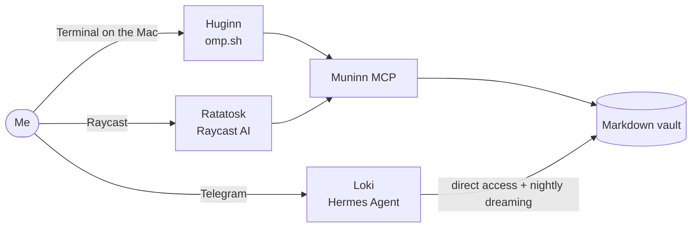

I run my personal AI assistant on an old Android phone. It reads my email, tracks my packages, remembers my projects, and works while I am asleep.

I have used it daily for about five months and more than 2,000 sessions. This is the honest version. What works, what does not, and what I would tell you before you copy it.

---

## My opinions, up front

- **The memory is the asset.** The model and the agent are replaceable parts.
- **Hermes is a good platform for a personal assistant.** It is not a stable one on a phone.
- **"Self-improving agent" is mostly marketing.** Skills are saved procedures, not learning.
- **More tools is not better.** Every capability is blast radius.
- **Build the watchdogs before the features.** I learned this the slow way.

## How it ties together

Everything points at the vault. That is the design. Every agent can die, be replaced, or switch model, and the vault stays.

The part I like most is not on the diagram as an extra arrow, because it does not need one. Huginn's coding sessions are logged into the vault. Every night Loki's dreaming job reads them, finds where I corrected Huginn, and writes those corrections into Huginn's rule notes in the vault. When I start a new Huginn session, it loads those same notes from Muninn before its first turn. So Huginn gets better at my conventions without me writing them down. The agents never talk to each other. They improve each other through the files.

## The roster

I name the agents after Norse mythology, because it helps me keep track of what is what.

**Loki** is the main agent. It runs on the phone inside Termux, on [Hermes Agent](https://github.com/NousResearch/hermes-agent), and talks to me over Telegram. It has the vault, my email, my calendar and a set of cron jobs. Loki can now fuck my life up a bit, so the dangerous parts need my explicit approval.

**Huginn** is the desktop agent. It is the [omp.sh](https://omp.sh) coding harness I use for code at the desk.

**Ratatosk** is the Raycast AI assistant on the Mac. It is what I use instead of a Google search.

**Muninn** is not really an agent. It is the vault exposed as an [MCP](https://modelcontextprotocol.io) server, so other tools can search, read and write the notes. **Ask Loki** is a second MCP server that runs the full phone agent instead of just touching files. I keep them separate on purpose. File access and full agent execution deserve different permissions.

## The vault is the asset

Most AI products make you their memory layer. You copy context between chats, re-explain decisions, and hope the next model remembers enough.

I refuse to do that. My memory should outlive the chat app, the model, the agent and the company selling all of them.

So the real memory is an [Obsidian](https://obsidian.md) vault. Plain markdown. Wikilinks. Git. If an agent writes something wrong, I open the file and fix it. If I drop Hermes tomorrow, the files are still mine. Durable and portable beats convenient and trapped.

Hermes has its own built-in memory too. It has a hard character cap, and mine sits at 99% of it. That is a feature. A small memory forces curation. It holds who I am and how I like things done. Everything else goes in the vault.

## What Hermes gets right

- **It lives where I already am.** Telegram is the front door. I can ask from the bus. Cron results land in the same chat.
- **It is actually model agnostic.** I switch between a self-hosted Qwen and subscription models in the middle of a conversation. Memory and skills come along.
- **Scheduled work is first class.** Around 20 cron jobs run my morning briefing, price watchers and nightly vault maintenance. An agent that only answers when asked is a chatbot.
- **Everything is a file.** Skills are markdown. Plugins are Python with hooks. When something annoys me, I fix it myself instead of waiting for a release.

## What Hermes gets wrong

- **Skills pile up.** I ended up with about 190 skills. 57% had never been loaded once. The whole catalog was still injected into every prompt, around 5,000 tokens before I had typed anything. I deleted 58 of them and wrote a plugin that only injects the few that fit the task. The first version picked exactly one skill, which broke every task that needed two.
- **Self-improvement is mostly self-documentation.** The agent saves workflows as skills and patches them when they fail. That helps. It also means a stale or overconfident procedure loads with the same authority as a good one. Someone has to review them. That someone is me.
- **It is not built for a phone.** Termux is not a first-class target. Updates can half-migrate and leave the install out of sync. The gateway crashed from native heap corruption five times in eight days. A watchdog restarts it. That is a workaround, not a fix.
- **Long sessions rot.** After thousands of messages, context gets compressed and models get weird. The fix is boring: shorter sessions and durable notes, not a smarter model.

## Automation lies by omission

This is the part nobody puts in the demo.

My nightly vault maintenance linked 113 orphaned notes every night. Another step in the same job deleted 151 links every night. The log said "linked 113 orphans" for a month. Nothing improved.

In one week, 27 scheduled runs failed or ended in an unknown state. In some of them the GPU box was reachable, but the model server on it was down. Nothing told me until I audited the runs.

I also gave Loki strict safety rules against prompt injection. Some models then started treating the platform's own message wrappers as attacks and refused ordinary requests. Around 40 false refusals before I traced it. Safety prompts are code. Code has bugs.

The lesson is the same every time. A green log line is not proof. Check the outcome, not the report.

## The phone tax

Running the brain of your setup on an old phone has a cost, and Android is the main villain.

- **Memory pressure kills.** One script loading a big file can take the whole stack down.
- **Silent half-death.** A connection can die inside a running process. Everything locks up, and a basic watchdog still thinks it is healthy.
- **Reboots wipe everything.** The stack only comes back through a boot script. If that fails, I notice when Loki stops answering.
- **Self-hosting is not free.** No token bill, but hardware, power, failed updates and my evenings. There is absolutely a bill.

There is one big upside people forget. **A phone has a built-in UPS.** When the power goes, the battery keeps the agent running. My desktop and GPU box go dark. The phone keeps answering on mobile data, and the cron jobs keep running. A server would need a UPS, a router on backup power and a fallback connection to match that.

Would I do it again? Yes. The phone is cheap, always on and always nearby. It is not reliable infrastructure, and I stopped pretending it is.

## What I actually use it for

- A morning briefing: calendar, weather, my stock watchlist, anything due
- Email triage, with drafts I approve before anything is sent
- Research and drafting
- Grocery price comparison across supermarkets
- Package tracking
- Calendar and reminders
- A nightly pass over the vault that consolidates notes and finds gaps

The pattern is the same in all of them. The agent has context I would never bother typing into an app, so it helps without making me start from zero.

## What you can copy

You do not need my setup. The minimal version is:

1. One markdown vault, versioned with git
2. One model you can replace without moving your data
3. One agent with only the tools it needs
4. One shared interface to the vault
5. One way to reach the agent from your phone

Start there. Add automation only after you know what failure looks like. The interesting part is not giving an agent more power. It is making sure your memory survives the next model, the next agent and the next company.
